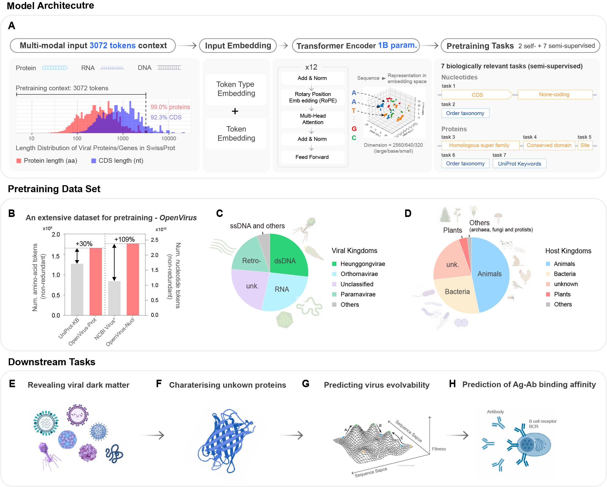
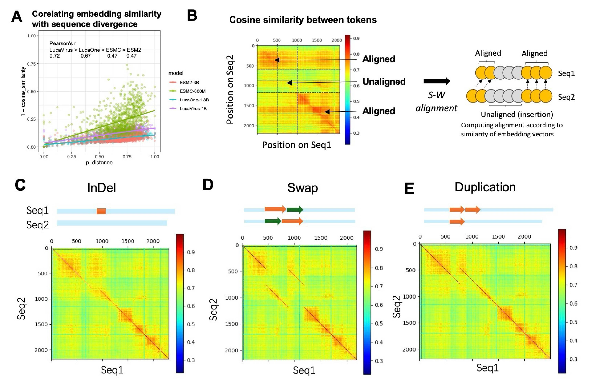
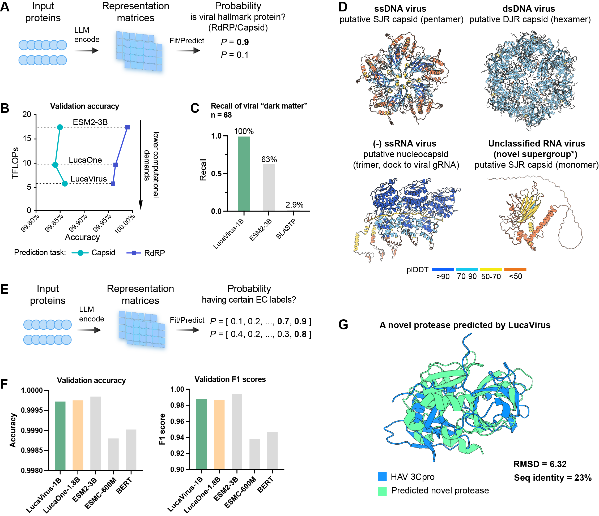
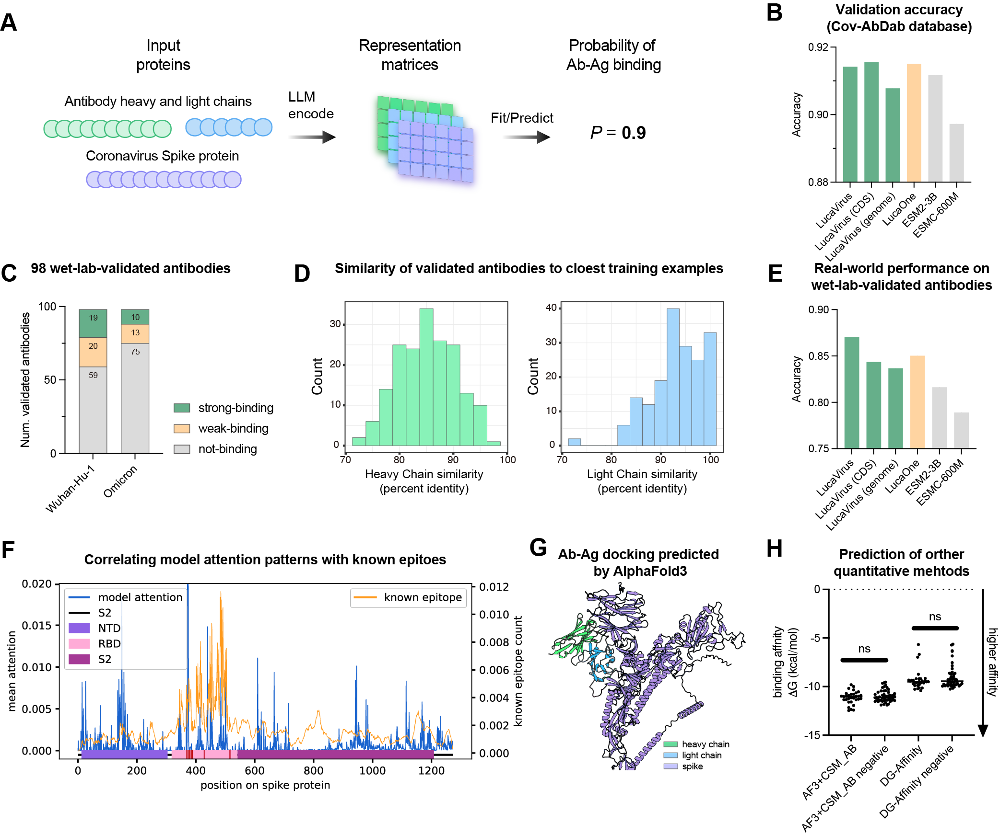

# LucaVirus     
LucaVirus: Modeling the Evolutionary and Functional Landscape of Viruses with a Unified Genome-Protein Language Model    

## TimeLine   
### **2025-06-26: Preprint**  
On June 16, 2025, the preprint version was released and LucaVirus and LucaVirusTasks were open-sourced.     

## 1. LucaVirus Workflow     

Fig. 1 The workflow of LucaVirus.

   

## 2. PreTraining Data    
**OpenVirus**   
We curated OpenVirus, a comprehensive, large-scale data set of viral sequences used to train the LucaVirus model. 
This data set comprises 15.7 million viral sequences, totaling 25.4 billion tokens—including 23.7 billion nucleotide tokens from 10.4 million sequences and 1.6 billion amino acid tokens from 5.2 million protein sequences.      
Nucleotide sequences were primarily sourced from the NCBI Virus database and seven independent viral diversity studies (9, 20-24), ensuring inclusion of sequences not available in NCBI.       
Protein sequences were obtained from the UniProtKB and MGnify databases.      
The OpenVirus data set covers all known viral taxa.     
The major groups include: double-strand (ds) DNA viruses (27% of sequences), RNA viruses (26%), reverse-transcribing viruses (20%), single-strand (ss) DNA viruses and others (6%), and unclassified viruses (21%).      
These four groups collectively account for 94% of the total sequence count.      
The data set includes viruses infecting all three domains and six kingdoms of cellular life, including animals (48%), bacteria (25%), plants (12%), protists (2%), fungi (2%), archaea (1%), and unknown hosts (22%).     

## 3. PreTraining Tasks    
LucaVirus employs a semi-supervised pre-training strategy, building on the framework established by LucaOne.     
The model initializes its corresponding layers with weights derived from LucaOne’s latest training checkpoint at step 1,760,000.    
The pre-training process integrates self-supervised masked language modeling (MLM) with seven biologically relevant supervised tasks to enhance the model’s ability to capture diverse biological features.     
These tasks are categorized as follows:     
Sequence-level classification tasks:     
(i) Order taxonomy prediction for nucleotide sequences;    
(ii) Order taxonomy prediction for protein sequences; 
and (iii) UniProt functional keyword prediction for protein sequences.      

Token-level classification tasks:     
(i) gene prediction for nucleotide sequences;    
(ii) protein homologous superfamily annotation;     
(iii) protein conserved domain annotation;      
and (iv) protein active site prediction.

 
## 4. Downstream Tasks        

### 1) Interpretable Representation of LucaVirus    

Fig. 2 LucaVirus learns interpretable representation of viral sequences that reflect genetic divergence.

   

### 2) Exploring the hidden diversity and functional proteins of viruses  

Fig. 3 Exploring the hidden diversity and functional proteins of viruses.

    

### 3) Fitting and predicting the fitness landscapes of a viral protein

Fig. 4 Fitting and predicting the fitness landscapes of a viral protein.

     

### 4) Performance of LucaVirus in antibody-antigen binding prediction

Fig. 5 Performance of LucaVirus in antibody-antigen binding prediction.  

     

## 5. Environment Installation
### step1: update git
#### 1) centos
sudo yum update     
sudo yum install git-all

#### 2) ubuntu
sudo apt-get update     
sudo apt install git-all

### step2: install python 3.9
#### 1) download anaconda3
wget https://repo.anaconda.com/archive/Anaconda3-2022.05-Linux-x86_64.sh

#### 2) install conda
sh Anaconda3-2022.05-Linux-x86_64.sh
##### Notice: Select Yes to update ~/.bashrc
source ~/.bashrc

#### 3) create a virtual environment: python=3.9.13
conda create -n lucavirus python=3.9.13

#### 4) activate lucavirus
conda activate lucavirus

### step3:  install other requirements
pip install -r requirements.txt -i https://pypi.tuna.tsinghua.edu.cn/simple    

### Create kernel(Optional)
conda activate lucavirus   
conda install ipykernel       
python -m ipykernel install --user --name lucavirus --display-name "Python(LucaVirus)"

##### install kernels for Jupyter
jupyter kernelspec list

##### remove kernel
jupyter kernelspec uninstall lucavirus    

## 6. CheckPoints    
<a href="http://47.93.21.181/lucavirus/TrainedCheckPoint/">CheckPoints</a>      
This project will download automatically LucaVirus Trained-CheckPoint from **FTP**.       

## 7. Embedding  Inference            
using `src/get_embedding.py` or `src/embedding/get_embedding.py`      
usage information refer to `src/embedding/README.md`  or `src/get_embedding_guidance.md`                  

## 8. Training Scripts      
**run_multi_v1.0.sh**     
use the LucaOne's checkpoint(`step=17600000` or `36000000`) for LucaVirus training.
 
**run_multi_v1.0_continue.sh**     
continue training when an interruption occurs.        

**run_multi_mask_v1.0.sh**     
training LucaVirus only using mask pretrain task.   

**run_multi_v1.0_gene.sh**   
training LucaVirus only using viral gene(DNA + RNA) data.  

**run_multi_v1.0_prot.sh**   
training LucaVirus only using viral protein data.     

**run_multi_v1.0_single.sh**   
training LucaVirus only using one GPU card.    

### TensorBoard for Loss Curve      
tensorboard --logdir tb-logs --bind_all --port 8008        

## 9. Data Availability        
The Pre-training data, downstream  tasks datasets will be open soon.   

## 10. Code Availability     
**Foundation Model:** <a href="https://github.com/LucaOne/LucaVirus">LucaVirus</a>      
**Downstream Tasks:** <a href="https://github.com/LucaOne/LucaVirus">LucaVirusTasks</a>    

## 11. Contributor             
<a href="https://scholar.google.com.hk/citations?user=RDbqGTcAAAAJ&hl=en" title="Yong He">Yong He</a>,    
<a href="https://scholar.google.com.hk/citations?hl=zh-CN&pli=1&user=Zhlg9QkAAAAJ" title="Yuan-Fei Pan">Yuan-Fei Pan</a>,      
<a href="https://scholar.google.com/citations?user=lT3nelQAAAAJ&hl=en" title="Zhaorong Li">Zhaorong Li</a>,    
<a href="https://scholar.google.com/citations?user=1KJOH7YAAAAJ&hl=zh-CN&oi=ao" title="Mang Shi">Mang Shi</a>,      
Yuqi Liu

## 12. Citation               

